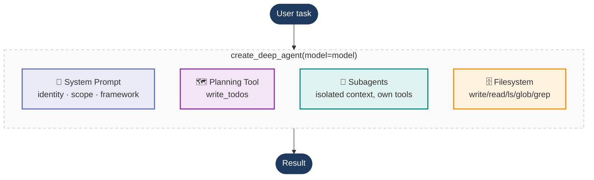

# Agent Harnesses, with Deep Agents

**The code companion for Chapter 7 — turning a model into a deep agent, one knob at a time.**

A model on its own predicts text. Wrap it in a **harness** — durable state, tool execution,
context management, feedback loops, enforceable constraints — and it becomes an agent that can
sustain long, complex work. The shorthand for the whole chapter:

> **Agent = Model + Harness**

This project uses [LangChain **Deep Agents**](https://blog.langchain.com/deep-agents/) as one
concrete harness. The headline idea is how *little* you write to get a capable agent: a single
`create_deep_agent(model=model)` call already assembles a planning tool, a filesystem, subagent
delegation, and a base system prompt. The rest of the chapter — and this repo — is a tour of the
knobs on that one object.

## The Big Idea

There is no formal definition of a "deep" agent, but in practice deep agents share four ideas.
Each example below turns on exactly one of them, changing a single argument to the *same*
`create_deep_agent` call from example 01.




Why these four? Long-horizon tasks fail from **context rot** — as iterations pile up, the context
window fills with noise and the model degrades. Planning externalizes progress, subagents isolate
work into separate contexts, the filesystem parks bulky artifacts off-context, and the system
prompt keeps behavior coherent. Together they keep the loop recoverable as the task grows.

---


## The Examples

Each file is self-contained and runnable on its own. Read them in order — each one adds a single
capability to the previous.


| #   | File                                         | Capability              | Knob             | What to look for when you run it                                                               |
| --- | -------------------------------------------- | ----------------------- | ---------------- | ---------------------------------------------------------------------------------------------- |
| 01  | [`01_bare_agent.py`](01_bare_agent.py)       | The bare harness        | *(none)*         | A full answer from a one-line agent — you configured nothing.                                  |
| 02  | [`02_planning_tool.py`](02_planning_tool.py) | Explicit planning       | *(built-in)*     | Printed todo lists evolving `[ ]` → `[~]` → `[x]` across steps.                                |
| 03  | [`03_subagents.py`](03_subagents.py)         | Hierarchical delegation | `subagents=`     | The coordinator has no lookup tool; it delegates and only the subagent's final result returns. |
| 04  | [`04_filesystem.py`](04_filesystem.py)       | Filesystem for state    | *(built-in)*     | The final answer **plus** a dump of `result["files"]` — artifacts kept off-context.            |
| 05  | [`05_system_prompt.py`](05_system_prompt.py) | The system prompt       | `system_prompt=` | The same agent answers an in-scope question but declines an out-of-scope one.                  |


### 01 · The bare deep agent

`create_deep_agent(model=model)` and nothing else. Establishes the two things every later example
reuses: the **invoke contract** (pass a message list, read the answer off the *last* message) and
the fact that the planning tool, file tools, and delegation machinery are already on board.

### 02 · The planning tool

Same bare agent — the planning tool ships by default. Give it a multi-deliverable task and it calls
the built-in `write_todos` tool, storing a structured list of items each with a `pending` /
`in_progress` / `completed` status and rewriting it between steps. We read that list off the message
history so you can watch the plan change.

### 03 · Subagents

Turn the `subagents=` knob. A coordinator delegates each topic lookup to a `fact-researcher`
subagent that has its own system prompt and its own tool. The coordinator *can't* look things up
itself — it must delegate through the built-in `task` tool, and it only ever sees the subagent's
final sentence, never its intermediate steps. That's context isolation.

### 04 · The filesystem

The file tools ship by default too. The agent writes intermediate notes to a **virtual** filesystem
(backed by agent state, not your real disk), reads them back, and composes a summary. Printing
`result["files"]` reveals the artifacts it parked off-context — the filesystem acting as a *context
engine*. In production you'd swap the backend and add path-based permissions; the interface is the
same.

### 05 · The system prompt

Turn the `system_prompt=` knob. A scoped support-assistant prompt built from the chapter's five
principles — clear identity/scope, empower-don't-constrain, a reasoning framework not a flowchart,
heuristic boundaries, and language efficiency. It answers in-scope requests and declines
out-of-scope ones.

---


## Quick Start

```bash
git checkout project/agent-harnesses
uv sync
```

Add your OpenAI key:

```bash
cp .env.example .env
# then edit .env and set OPENAI_API_KEY=...
```

Run each example:

```bash
uv run python 01_bare_agent.py
uv run python 02_planning_tool.py
uv run python 03_subagents.py
uv run python 04_filesystem.py
uv run python 05_system_prompt.py
```


## Prerequisites

- **Python 3.11+** and [`uv`](https://docs.astral.sh/uv/).
- `OPENAI_API_KEY` in `.env`. The model lives in one place — [`models.py`](models.py) — so you
  can swap to a smaller OpenAI model or another provider by editing a single line.
- **LangSmith API key** in `.env` (optional, for tracing).

> Verified against `deepagents 0.6.8`. The built-in tools and base prompt are versioned
> implementation details of the harness and evolve with the package.

